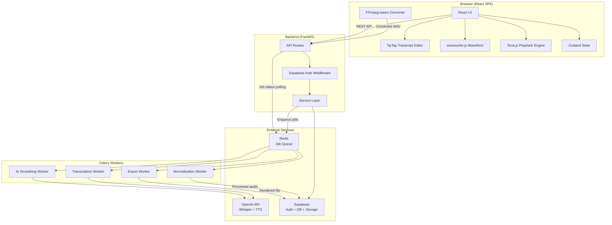
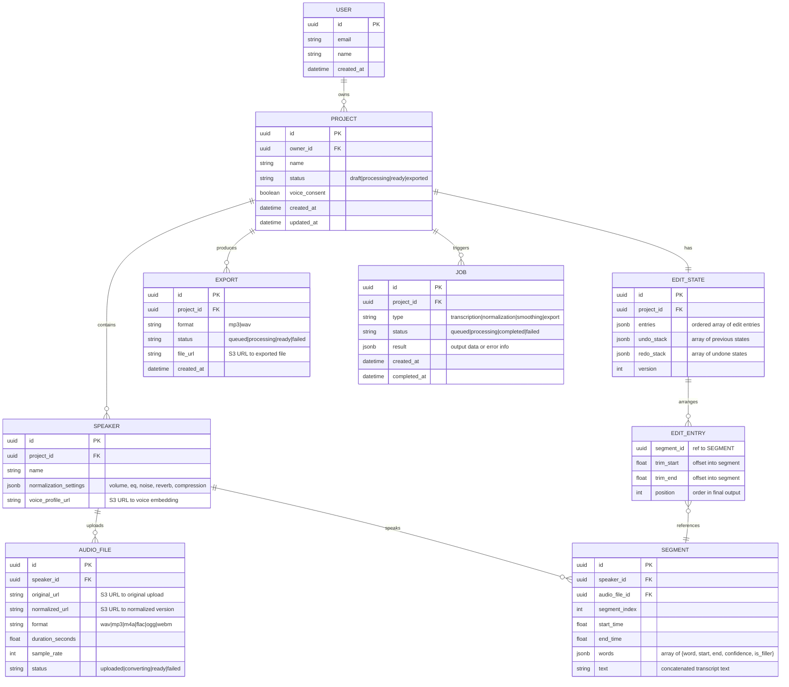

# Architecture — AI Audio Editor

## System Overview

## Data Models

### Entity Relationship Diagram

### Key Model Notes

- **EDIT_STATE** stores the entire editing playlist as a JSONB array of entry references. This avoids a join table and makes undo/redo trivial (snapshot the whole array).
- **EDIT_ENTRY** is not a table — it's a structured JSONB element within `EDIT_STATE.entries`. Each entry points to a `SEGMENT` by ID with optional trim offsets.
- **SEGMENT.words** stores word-level timestamps as JSONB for flexible querying and direct use by the transcript editor.
- **AUDIO_FILE** tracks both original and normalized versions. Originals are immutable.

## API Contracts

Base URL: `/api/v1`

### Projects

| Method | Endpoint | Request | Response | Description |
|--------|----------|---------|----------|-------------|
| POST | `/projects` | `{name, voice_consent}` | `Project` | Create new project |
| GET | `/projects` | — | `Project[]` | List user's projects |
| GET | `/projects/:id` | — | `Project` (full, with speakers & segments) | Get project details |
| PATCH | `/projects/:id` | `{name?, voice_consent?}` | `Project` | Update project |
| DELETE | `/projects/:id` | — | `204` | Delete project and all assets |

### Speakers

| Method | Endpoint | Request | Response | Description |
|--------|----------|---------|----------|-------------|
| POST | `/projects/:id/speakers` | `{name}` | `Speaker` | Add speaker to project |
| PATCH | `/projects/:id/speakers/:sid` | `{name?, normalization_settings?}` | `Speaker` | Update speaker settings |
| DELETE | `/projects/:id/speakers/:sid` | — | `204` | Remove speaker |

### Audio Upload

| Method | Endpoint | Request | Response | Description |
|--------|----------|---------|----------|-------------|
| POST | `/projects/:id/speakers/:sid/upload` | `multipart/form-data {file}` | `AudioFile` | Upload audio for speaker |
| GET | `/audio-files/:fid` | — | `AudioFile` | Get audio file metadata |
| GET | `/audio-files/:fid/stream` | `Range` header | Audio stream | Stream audio file content |

### Transcription

| Method | Endpoint | Request | Response | Description |
|--------|----------|---------|----------|-------------|
| POST | `/projects/:id/transcribe` | — | `Job` | Start transcription job for all speakers |
| GET | `/projects/:id/transcript` | — | `Segment[]` | Get transcript segments |
| PATCH | `/segments/:sid` | `{text?, words?}` | `Segment` | Correct transcription text |

### Edit State

| Method | Endpoint | Request | Response | Description |
|--------|----------|---------|----------|-------------|
| GET | `/projects/:id/edit-state` | — | `EditState` | Get current edit state |
| PUT | `/projects/:id/edit-state` | `{entries, version}` | `EditState` | Save edit state (optimistic locking via version) |
| POST | `/projects/:id/edit-state/undo` | — | `EditState` | Undo last edit |
| POST | `/projects/:id/edit-state/redo` | — | `EditState` | Redo last undo |

### Normalization

| Method | Endpoint | Request | Response | Description |
|--------|----------|---------|----------|-------------|
| POST | `/projects/:id/normalize` | `{speaker_ids?}` | `Job` | Queue normalization for all or specified speakers |

### AI Smoothing

| Method | Endpoint | Request | Response | Description |
|--------|----------|---------|----------|-------------|
| POST | `/projects/:id/smooth` | `{boundary_pairs: [{left_segment_id, right_segment_id}]}` | `Job` | Queue AI boundary smoothing for specified edit points |

### Export

| Method | Endpoint | Request | Response | Description |
|--------|----------|---------|----------|-------------|
| POST | `/projects/:id/export` | `{format: "mp3"|"wav"}` | `Export` | Queue export rendering |
| GET | `/exports/:eid` | — | `Export` | Get export status |
| GET | `/exports/:eid/download` | — | File stream | Download exported file |

### Jobs

| Method | Endpoint | Request | Response | Description |
|--------|----------|---------|----------|-------------|
| GET | `/jobs/:jid` | — | `Job` | Get job status |
| GET | `/projects/:id/jobs` | `?status=&type=` | `Job[]` | List jobs for project |

## Key Architectural Decisions

### 1. SPA + Separate API (not Next.js)
**Decision**: Vite React SPA with standalone FastAPI backend.
**Rationale**: The app is fundamentally a client-heavy audio tool. Audio playback, waveform rendering, and text editing all happen in the browser. SSR provides no benefit and adds complexity. A clean separation also lets the Python backend leverage the rich AI/audio ecosystem without frontend coupling.

### 2. Edit State as JSONB Snapshot (not relational join table)
**Decision**: Store the edit playlist as a single JSONB column with full undo/redo stacks.
**Rationale**: The edit state changes atomically with every user action. Storing it as JSONB makes reads/writes O(1) with no joins. Undo/redo is just swapping snapshots. The tradeoff is no relational querying of individual entries — but we never need that; the edit state is always loaded as a whole.

### 3. Client-Side Format Conversion via FFmpeg.wasm
**Decision**: Convert uploaded audio to WAV in the browser before uploading.
**Rationale**: Reduces backend complexity and server compute. The browser handles format conversion; the backend always receives normalized WAV files. Tradeoff: slightly longer upload UX on slow devices, but can show progress.

### 4. OpenAI APIs for All AI Operations
**Decision**: Use OpenAI Whisper for transcription and OpenAI TTS for voice generation/smoothing.
**Rationale**: Simplest integration path for a solo developer. Pay-per-use avoids GPU infrastructure costs. Quality is production-ready. The service layer abstracts the provider, so switching to self-hosted models later is straightforward.

### 5. Non-Destructive Editing with Server-Side Rendering
**Decision**: Client plays back segments in real-time via Tone.js from a playlist of references. Server renders the final mixed audio on export.
**Rationale**: Client-side real-time playback gives instant feedback. Server-side export applies all normalization, AI smoothing, and mixing at full quality without browser memory constraints. This hybrid avoids both "everything in the browser" complexity and "everything on the server" latency.

### 6. Supabase for Auth, DB, and Storage
**Decision**: Use Supabase as the unified backend-as-a-service layer.
**Rationale**: Single service provides PostgreSQL, auth (with social login), and S3-compatible object storage. Reduces operational burden for a solo developer. Row-level security policies can enforce access control at the DB level.

### 7. Polling for Job Status (not WebSockets in V1)
**Decision**: Frontend polls `/jobs/:id` for async job progress. No WebSocket push in V1.
**Rationale**: Simpler to implement and debug. Jobs (transcription, export) take 10s–5min; polling every 2-5 seconds is acceptable. WebSocket push is planned for V2 real-time collaboration.

## External Dependencies & Integration Points

| Dependency | Purpose | Integration Point | Failure Mode |
|---|---|---|---|
| **OpenAI Whisper API** | Audio transcription with word-level timestamps | `services/transcription.py` via `openai` SDK | Retry 3x with backoff → mark job failed |
| **OpenAI TTS API** | Voice generation for AI boundary smoothing | `services/smoothing.py` via `openai` SDK | Fallback to crossfade transition |
| **Supabase Auth** | User authentication (email + social) | JWT verification middleware in FastAPI | 401 on invalid token |
| **Supabase Storage** | Audio file storage (original + processed) | `services/storage.py` via `supabase-py` SDK | Retry upload → surface error to user |
| **Supabase PostgreSQL** | All relational data | SQLAlchemy async engine | Connection pool with retries |
| **Redis** | Celery job queue + result backend | Celery broker/backend config | Queue backpressure → reject new jobs |
| **FFmpeg.wasm** | Client-side audio format conversion | `services/audioConverter.ts` | Show error, allow raw upload as fallback |
| **wavesurfer.js** | Waveform visualization | `components/WaveformViewer.tsx` | Degrade to transcript-only view |
| **Tone.js** | Real-time audio segment playback | `services/audioEngine.ts` | Basic HTML5 Audio fallback |
| **TipTap** | Script-style transcript text editor | `components/TranscriptEditor.tsx` | Core feature — no fallback |
